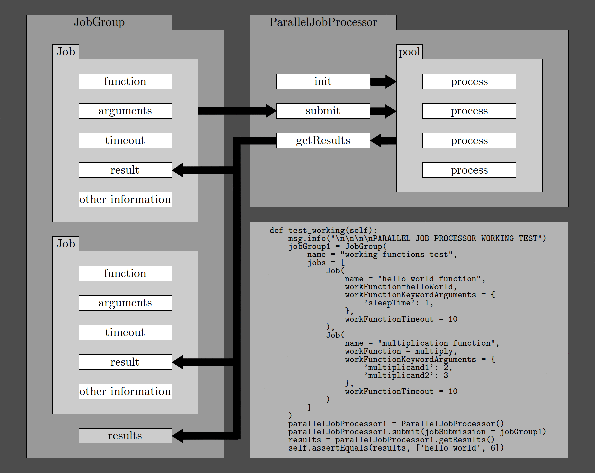

# janus

parallel job processor using multiprocessing

# quick start

The example script ```pi_estimation.py``` is an illustration of the usage of janus. Its use is shown in the video [here](https://www.youtube.com/watch?v=hz4z9wJg43Y).

# introduction

Janus consists of the concepts of a job, a job group, a parallel job processor and other associated ideas. Essentially, jobs consist of a function and its arguments and a job group is a group of such jobs. The parallel job processor uses [multiprocessing](https://docs.python.org/2/library/multiprocessing.html) to run the jobs in separate, parallel processes and manages results and exceptions.

Below is a non-exhaustive illustration of janus.



# future

Janus uses [pickle](https://docs.python.org/2.7/library/pickle.html) for Python object serialisation. Changing to [dill](https://pypi.python.org/pypi/dill) is under consideration.
